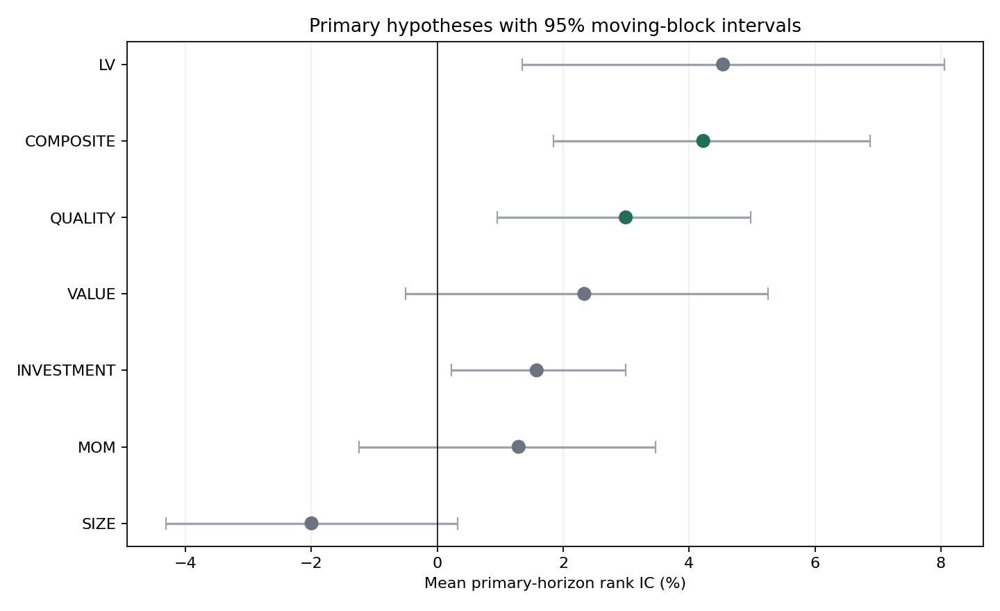
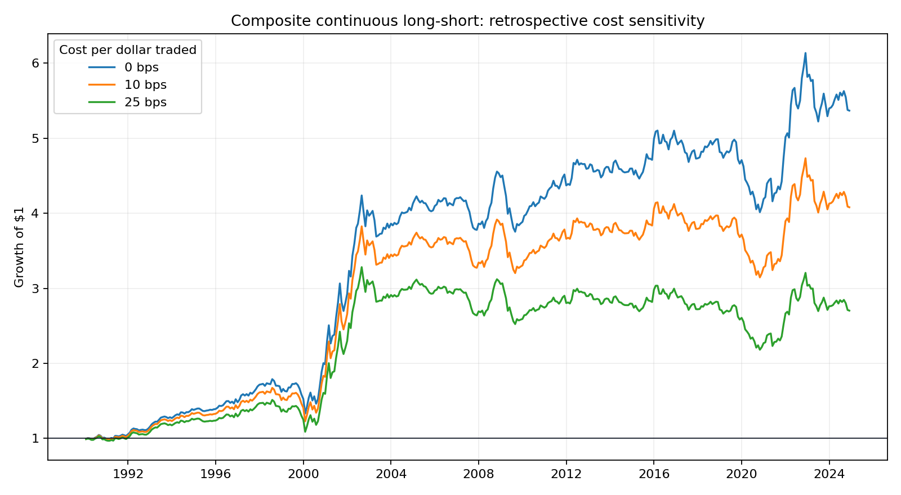
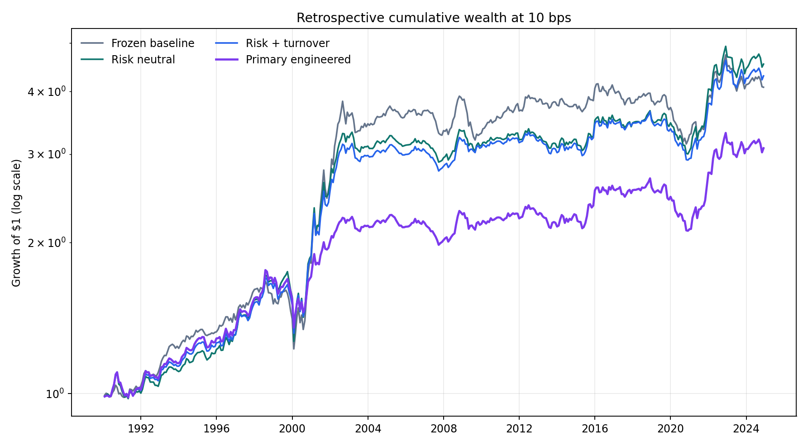
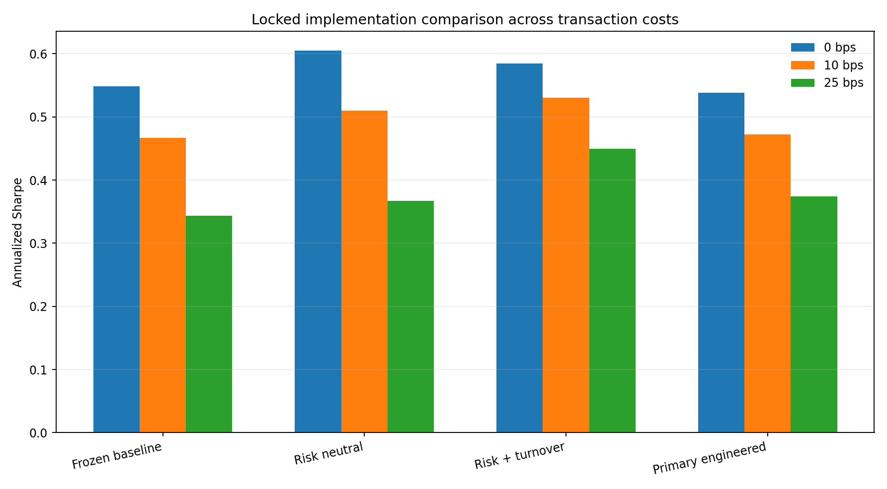
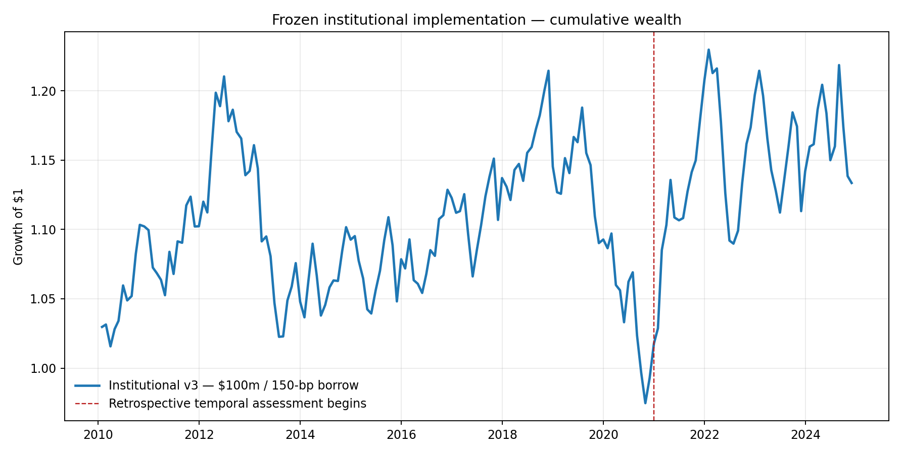
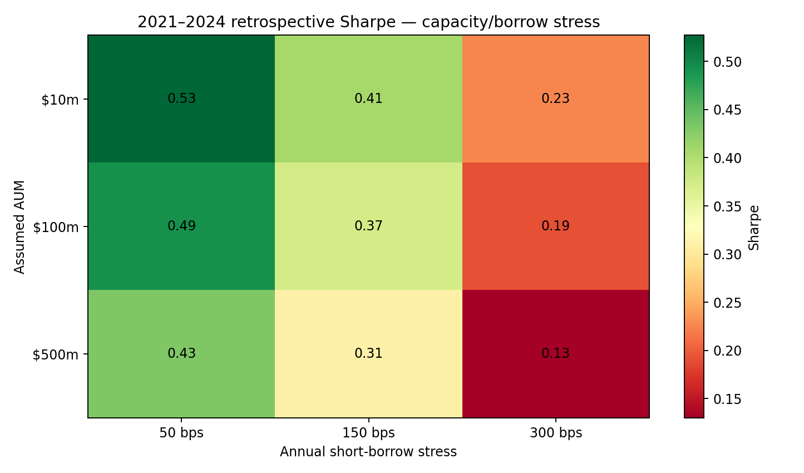
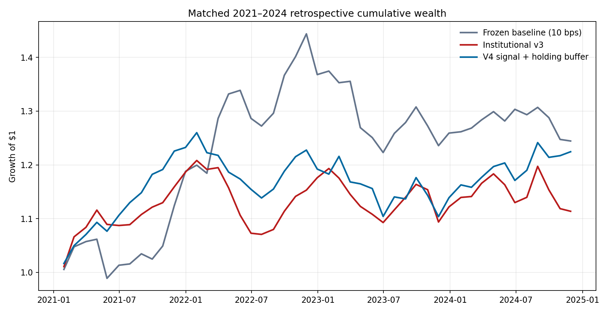
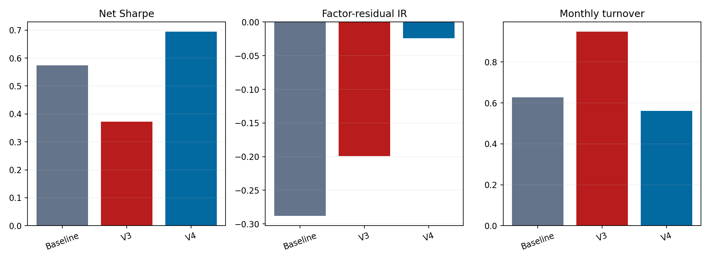
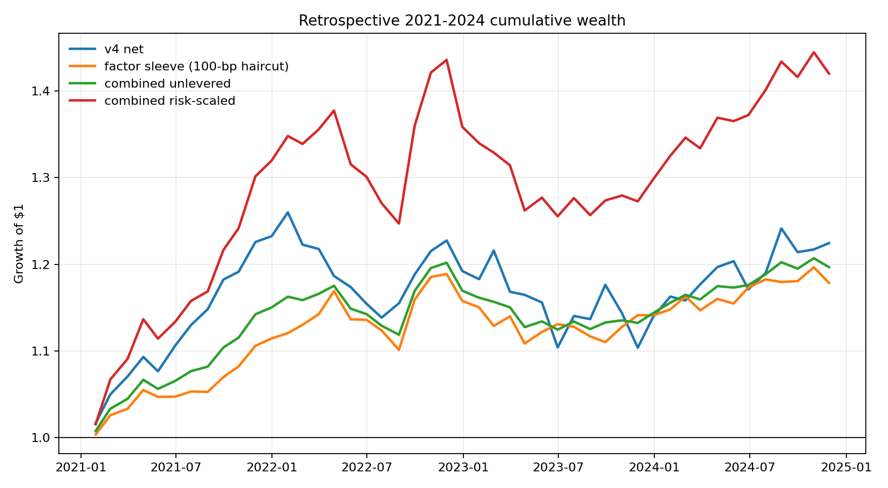
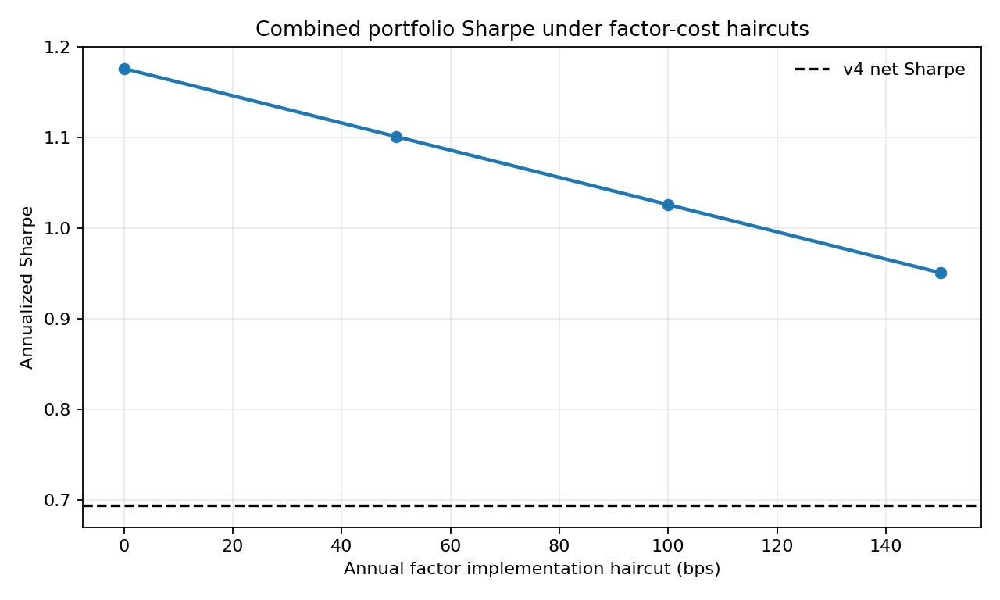

# Point-in-Time U.S. Equity Factor Research

A reproducible cross-sectional research platform for testing economically
motivated equity signals with CRSP, Compustat, and the CRSP/Compustat Merged
link history. The project emphasizes point-in-time controls, explicit hypothesis
families, implementation costs, and honest separation of retrospective evidence
from future validation.

## Research verdict

The 1990–2024 retrospective replication finds a statistically credible
cross-sectional composite, but not a validated standalone trading alpha.

| Primary result | Estimate |
|---|---:|
| Composite 12-month rank IC | **4.22%** |
| HAC t-statistic / raw p-value | **3.18 / 0.0014** |
| Holm-adjusted primary-family p-value | **0.0101** |
| 95% moving-block bootstrap interval | **1.85% to 6.87%** |
| Positive-IC month share | **66.7%** |
| 10-bps continuous long-short Sharpe | **0.47** |
| 10-bps continuous long-short CAGR | **4.11%** |
| Maximum drawdown | **-26.62%** |
| FF5 + momentum alpha | **1.06% annually; HAC t=1.10** |

The composite and gross-profitability quality hypotheses pass every declared
retrospective gate. The portfolio's factor-adjusted alpha does not. The correct
classification is therefore **retrospectively supported signal structure, no
validated prospective alpha**.





## Locked portfolio-engineering follow-up

After freezing the baseline above, a separate protocol tested whether explicit
risk and implementation controls could convert the same composite score more
efficiently. The primary candidate was fixed before its returns were calculated:
inverse-volatility score scaling; dollar, beta, SIC-sector, and log-size
neutrality; a 1.5% position cap; partial rebalancing with a no-trade band; and
trailing volatility targeting.

| 10-bps result | Frozen baseline | Primary engineered |
|---|---:|---:|
| Sharpe | 0.466 | 0.472 |
| CAGR | 4.11% | 3.28% |
| Annualized volatility | 9.62% | 7.42% |
| Maximum drawdown | -26.62% | -23.21% |
| Average monthly turnover | 0.657 | 0.405 |

The engineered portfolio reduced turnover by 38% and improved drawdown, but its
Sharpe gain was only 0.006. A paired 12-month moving-block bootstrap interval
for that gain was -0.163 to 0.212, so the improvement is not statistically
reliable. Its retrospective FF5-plus-momentum alpha was 2.26% annually
(HAC t=2.54, p=0.011), but this follow-up was motivated after inspecting the
baseline and is not prospective evidence.

The locked risk-plus-turnover comparator reached a descriptive 0.531 Sharpe at
10 bps, but it was not the predeclared primary candidate and is not substituted
after the fact. The honest conclusion remains: better implementation quality,
no validated alpha.





The complete protocol and audit trail are in
[`results/portfolio_engineering/`](results/portfolio_engineering/README.md).

## Institutional version-3 implementation

A third, separately frozen experiment tested whether daily risk estimates and a
convex institutional implementation could improve the same unchanged composite.
The architecture uses a 252-day Ledoit-Wolf shrinkage covariance matrix, CVXPY
optimization, residualized alpha forecasts, beta/sector/size/position controls,
lagged CRSP closing-spread estimates, ADV-based nonlinear impact, explicit
borrow costs, and pre-2020 purged candidate selection.

The constraint-only feasibility audit and every pre-result protocol amendment
are preserved in [`institutional_v3_protocol.json`](institutional_v3_protocol.json).
No amendment used a forward return or performance metric.

| 2021-2024 matched result | Frozen 10-bps baseline | Institutional v3 primary |
|---|---:|---:|
| Sharpe | 0.573 | 0.372 |
| CAGR | 5.74% | 2.79% |
| Maximum drawdown | -15.28% | -11.38% |
| Average monthly turnover | 0.627 | 0.948 |

The primary scenario assumes $100 million AUM and 150 bps of annual short-borrow
cost. Its Sharpe difference versus the baseline was -0.201, with a paired
12-month moving-block 95% interval of -1.616 to 0.658. It improved drawdown and
reduced beta exposure, but higher name churn and explicit capacity/borrow costs
overwhelmed those benefits. The formal conclusion is **no robust retrospective
improvement and no validated alpha**.

This negative result is intentionally retained. It demonstrates that a more
sophisticated optimizer does not rescue a modest signal automatically and that
portfolio complexity must earn its implementation costs.





The complete protocol, purged-selection ledger, cost stress, constraints,
diagnostics, and aggregate monthly evidence are in
[`results/institutional_v3/`](results/institutional_v3/README.md).

## Version-4 signal and holding-buffer follow-up

After the v3 cost decomposition identified membership churn, a fourth,
explicitly post-result protocol tested one fixed correction. A development-only
ensemble uses 2010–2019 IC across 1/3/6/12-month horizons, clips negative
development weights, and shrinks them 50% toward equal weights. `SIZE_SCORE` is
excluded because the portfolio separately enforces size neutrality. No
hyperparameter grid was searched.

The implementation admits new positions at absolute residual-score rank 200
or better, explicitly carries current holdings into the next risk pool, and
allows them to remain through rank 500. It retains v3's covariance, exposure,
spread, impact, borrow, and CVXPY architecture while imposing a 0.75 turnover
ceiling and position-level ADV capacity limits.

| Matched 2021–2024 result | Frozen baseline | Institutional v3 | Version 4 |
|---|---:|---:|---:|
| Net Sharpe / overlay IR | 0.573 | 0.372 | **0.694** |
| CAGR | **5.74%** | 2.79% | 5.31% |
| Maximum drawdown | -15.28% | **-11.38%** | -12.39% |
| Average monthly turnover | 0.627 | 0.948 | **0.561** |
| FF5+momentum residual IR | -0.288 | -0.199 | **-0.024** |

| Matched score diagnostic | Equal composite | Version 4 |
|---|---:|---:|
| 12-month rank IC | 2.77% | **5.60%** |
| 12-month ICIR | 0.401 | **1.087** |
| 12-month HAC t-statistic | 0.97 | **3.50** |

The overlay IR equals net Sharpe by construction: for a self-financing
dollar-neutral sleeve, the sleeve return is the active return and its
volatility is the tracking-error contribution. It is not presented as a second
independent performance win. The stricter FF5+momentum residual IR improved but
remained slightly negative, and the paired block-bootstrap interval for the
0.121 Sharpe gain versus baseline was -1.396 to 0.735. The correct verdict is
**multi-metric retrospective improvement, not statistically confirmed or
validated alpha**.

Two performance-uninformed feasibility amendments are recorded in
[`institutional_v4_protocol.json`](institutional_v4_protocol.json). Both
occurred before any v4 return, IC, Sharpe, or IR was calculated. Complete
aggregate evidence is in
[`results/institutional_v4/`](results/institutional_v4/README.md).





## Profitable-factor allocation follow-up

Because v4's factor-residual alpha is economically zero, a final allocation
study asks a different question: can the portfolio deliberately combine v4
with established factor premiums more efficiently? This is an explicitly
retrospective, performance-informed factor-harvesting exercise, not a claim of
new factor-neutral alpha.

Factor weights use 1990-2019 data only: 50% equal weight plus 50% normalized
positive development Sharpe across MKT-RF, SMB, HML, RMW, CMA, and UMD, capped
at 30% per factor. A 2010-2019 inverse-volatility rule then assigns 31.2% to v4
net returns and 68.8% to the factor sleeve. The primary result applies a
conservative 100-bp annual implementation haircut to the academic factor
returns.

| Matched 2021-2024 result | V4 net | Factor sleeve | Combined unlevered | Combined 2x diagnostic |
|---|---:|---:|---:|---:|
| Sharpe | 0.694 | 0.820 | **1.026** | **1.026** |
| CAGR | 5.31% | 4.28% | 4.69% | **9.36%** |
| Annualized volatility | 7.91% | 5.28% | 4.58% | 9.15% |
| Maximum drawdown | -12.39% | -6.74% | **-6.43%** | -12.57% |

The factor tilt's IR versus an otherwise identical equal-factor combination is
0.639. Its active IR versus v4 is -0.127 because diversification increased
risk-adjusted performance while slightly reducing average return. The paired
12-month block interval for the 0.332 Sharpe improvement over v4 is -0.180 to
1.121, so the improvement is **not statistically confirmed**. The combined
portfolio has no separate cross-sectional IC; v4's 5.60% 12-month rank IC
remains the applicable stock-selection diagnostic.

Complete factor weights, 0/50/100/150-bp cost stresses, aggregate monthly
returns, protocol, receipts, and charts are in
[`results/profitable_factor_portfolio/`](results/profitable_factor_portfolio/README.md).





The prospective ledger starts in 2025 and remains `NOT_STARTED`: WRDS supplied
data only through December 2024. At least 36 genuinely new, never-inspected
months are required before any prospective conclusion is allowed.

## Predeclared hypothesis ledger

Each signal has one primary horizon. Primary tests and exploratory horizons are
separate Holm-corrected families.

| Signal | Primary horizon | Retrospective result |
|---|---:|---|
| Fixed six-signal composite | 12 months | **Retrospectively supported** |
| Gross profitability quality | 12 months | **Retrospectively supported** |
| Low volatility | 12 months | Directional; fails quantile monotonicity |
| Intermediate momentum | 6 months | Directional; fails adjusted significance/bootstrap |
| Conservative investment | 12 months | Directional; fails adjusted significance/monotonicity |
| Book-to-market value | 12 months | Directional; fails adjusted significance/monotonicity |
| Small size | 12 months | **Expected direction rejected** |

The machine-readable gate ledger is
[`results/wrds_real_data/hypothesis_tests.csv`](results/wrds_real_data/hypothesis_tests.csv).

## Why this repository is useful

This is not a collection of optimized backtest settings. It is a compact
institutional-style research system that demonstrates:

- point-in-time CRSP security histories and PERMCO-level share-class consolidation;
- CRSP delisting-adjusted returns;
- CCM-linked Compustat annual fundamentals with preliminary/final availability
  dates when present and a conservative six-month fallback;
- an investable top-1,000-company universe with explicit price and market-cap gates;
- sector and size neutralization without return-fitted factor weights;
- 1/3/6/12-month Spearman IC, HAC inference, Holm correction, and deterministic
  moving-block bootstrap intervals;
- calendar-decade stability and quintile-monotonicity diagnostics;
- continuous-score and quintile portfolios with turnover and 0/10/25-bps costs;
- a separately frozen beta/sector/size-neutral, turnover-aware portfolio
  engineering experiment with paired block-bootstrap comparison;
- a separately frozen daily-risk/CVXPY implementation with purged candidate
  selection, shrinkage covariance, capacity/borrow stress, and a documented
  negative result;
- a separately frozen retrospective development-IC ensemble and rank-buffered
  low-churn implementation with explicit overlay-IR and residual-IR definitions;
- Fama–French five-factor plus momentum attribution; and
- aggregate-only public evidence, with licensed security rows kept private.

## Research design

- **Sample:** January 1990 through December 2024; 420 months, 4,439 companies,
  and a 1,000-company monthly universe.
- **Universe:** NYSE/AMEX/Nasdaq common stocks, price at least $5, market
  capitalization at least $100 million, largest 1,000 eligible companies monthly.
- **Entity:** CRSP `PERMCO`; share classes use aggregate market equity and
  market-equity-weighted company returns.
- **Signals:** 12–1 momentum, low volatility, size, book-to-market value, gross
  profitability quality, and conservative asset growth.
- **Scoring:** 1st/99th percentile winsorization, SIC-sector neutralization,
  log-market-cap neutralization for non-size signals, cross-sectional z-scores,
  and a fixed equal-weight composite.
- **Primary implementation:** continuous-score dollar-neutral long-short,
  charged 10 bps per dollar traded. Quintile portfolios and alternate costs are
  comparators, not alternate headline searches.
- **Inference:** one primary horizon per hypothesis; other horizons are
  exploratory. Formal gates combine expected direction, Holm-adjusted
  significance, block-bootstrap confidence, hit rate, decade stability, and
  quintile monotonicity.

## Validation chronology

The repository does not relabel inspected data as an untouched holdout.

1. A 2010–2023 engine-validation run exposed a share-class continuity defect.
2. A short 2024 confirmation was inspected and found too short for inference.
3. Version 2 reclassifies all data through 2024 as retrospective, extends the
   replication to 1990, and locks the future-only validation protocol.
4. No parameter changes are permitted before 36 post-2024 observations exist.

This chronology is recorded in
[`specification.json`](results/wrds_real_data/specification.json) and
[`research_protocol.json`](results/wrds_real_data/research_protocol.json).

## Reproduce it

The deterministic synthetic path is credential-free and used by CI:

```bash
python -m pip install -r requirements.txt
python run_model.py --offline
python -m pytest -q
```

The real-data path requires licensed WRDS access. Credentials stay in the
user's normal local WRDS/PostgreSQL configuration and are never accepted as
command-line arguments:

```bash
python -m pip install -r requirements-live.txt
python run_wrds_model.py --scope retrospective --refresh
python run_portfolio_engineering.py
python run_institutional_v3.py
python run_institutional_v4.py
python run_profitable_factor_portfolio.py
```

Security-level licensed rows are written only beneath ignored `data/private/`.
Committed artifacts contain aggregate statistics, portfolio-level derived
returns, coverage, quality receipts, and hashes of the private inputs.

## Evidence limitations

- Compustat `funda` is not a vintage database; preliminary/final dates and the
  fallback lag reduce obvious look-ahead but cannot reconstruct every revision.
- SIC groups and log market capitalization are transparent controls, not a
  commercial risk model.
- Linear costs exclude borrow fees, nonlinear impact, and capacity constraints.
- The continuous portfolio is dollar neutral but not explicitly beta neutral;
  realized factor exposures are reported rather than hidden.
- Portfolio engineering was designed after the baseline was inspected. It is
  labeled retrospective and cannot serve as an untouched confirmation.
- Versions 3 and 4 were also designed after earlier results were inspected.
  Version 4 improved several retrospective metrics, but its Sharpe-difference
  interval includes zero and its FF5+momentum residual IR remains slightly
  negative.
- Retrospective support is not live performance. The prospective result remains
  unopened and unavailable.

## Repository map

```text
run_wrds_model.py            # frozen real-data study and evidence writer
run_portfolio_engineering.py # separately frozen implementation experiment
run_institutional_v3.py      # daily-risk/cost-aware institutional experiment
run_institutional_v4.py      # development-IC ensemble and holding-buffer follow-up
run_profitable_factor_portfolio.py # established-premium allocation follow-up
src/factors/wrds_data.py     # bounded CRSP/Compustat acquisition
src/factors/real_model.py    # PIT signals, inference, portfolios, diagnostics
src/factors/portfolio_engineering.py # risk, constraints, turnover, bootstrap
src/factors/institutional_v3.py # shrinkage covariance, optimizer, costs
src/factors/institutional_v4.py # ensemble, hysteresis, capacity, residual IR
src/factors/profitable_factor_portfolio.py # factor tilt, sleeve mix, cost stress
results/wrds_real_data/      # primary aggregate evidence and protocol
results/portfolio_engineering/ # implementation evidence and integrity receipt
results/institutional_v3/    # frozen v3 aggregate evidence
results/institutional_v4/    # frozen v4 aggregate evidence
run_model.py                 # deterministic credential-free CI demonstration
tests/                       # data, inference, security, and artifact contracts
```

Python 3.10+ is recommended. This is research software, not investment advice.
