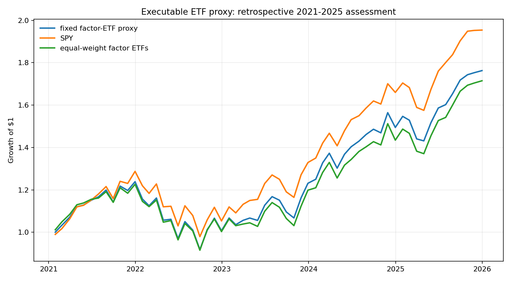
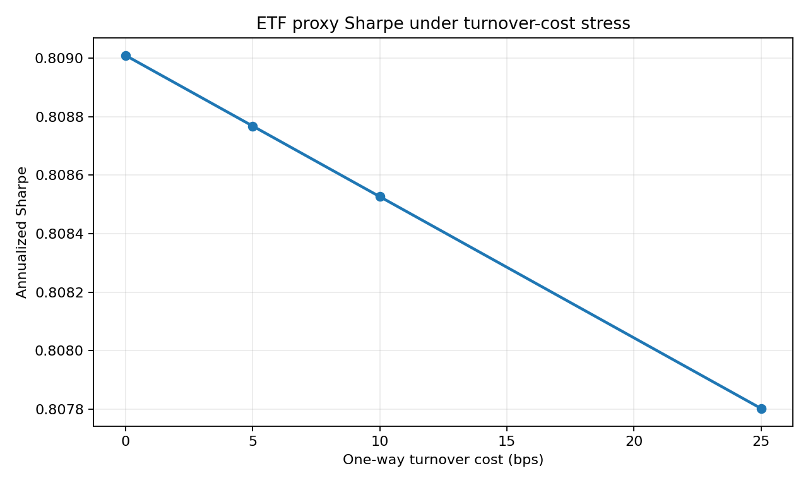

# Retail factor-ETF proxy

This is the first executable translation of the academic profitable-factor
sleeve. The mapping and rules were frozen before ETF outcomes were downloaded.
It is a retrospective paper-trading candidate, not a live record or investment
recommendation.

## Primary 2021-2025 result

At the locked 10-bp one-way turnover cost, the fixed-weight ETF proxy recorded:

- CAGR: **12.00%**;
- annualized volatility: **15.57%**;
- Sharpe: **0.809**;
- maximum drawdown: **-25.85%**;
- active IR versus SPY: **-0.775**;
- active IR versus equal-weight factor ETFs: **0.333**.

SPY recorded **0.965 Sharpe** and the equal-weight five-ETF
benchmark recorded **0.765**. The paired 12-month moving-block
interval for the proxy-minus-SPY Sharpe difference is **[-0.311, -0.050]**.

## Fixed holdings

- SPY 21.98%
- IWM 12.01%
- VLUE 12.91%
- QUAL 35.91%
- MTUM 17.19%

QUAL combines the RMW and CMA academic weights and is therefore an imperfect
proxy for conservative investment. Returns use adjusted public price history,
monthly close-to-close rebalancing, fractional shares, no leverage, and no
shorting. Raw price rows remain in ignored local storage.
