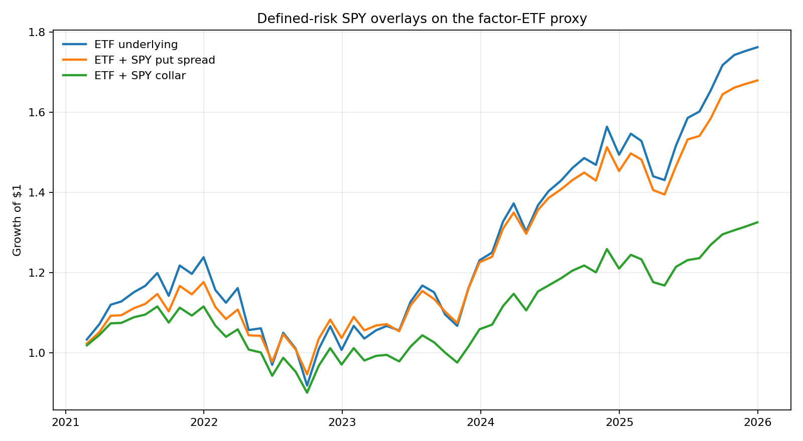

# SPY options overlay on the retail factor-ETF proxy

This frozen retrospective study uses exact ORATS SPY contracts, executable
bid/ask prices, and defined-risk structures only. Raw licensed chains and exact
contract identities remain in ignored local storage.

## Coverage

- planned monthly observations: **59**;
- executable exact-contract observations: **59**;
- coverage: **100.0%** (PASS versus the locked 80% threshold);
- ORATS entry/exit response sets used: **118**.

## Results on covered months

- ETF underlying: **0.815 Sharpe**, **12.21% CAGR**, **-25.85% max drawdown**;
- ETF + put spread: **0.870 Sharpe**, **11.12% CAGR**, **-19.58% max drawdown**, **-0.420 active IR**;
- ETF + collar: **0.588 Sharpe**, **5.89% CAGR**, **-19.29% max drawdown**, **-1.157 active IR**.

Long options enter at the ask and exit at the bid; short options enter at the
bid and exit at the ask. Each trade includes a $0.65-per-contract fee. Contracts
use 35-49 DTE, target 42 DTE, fixed deltas, one same expiration, and exact-identity
exit matching. This is club research, not a recommendation to trade options.
